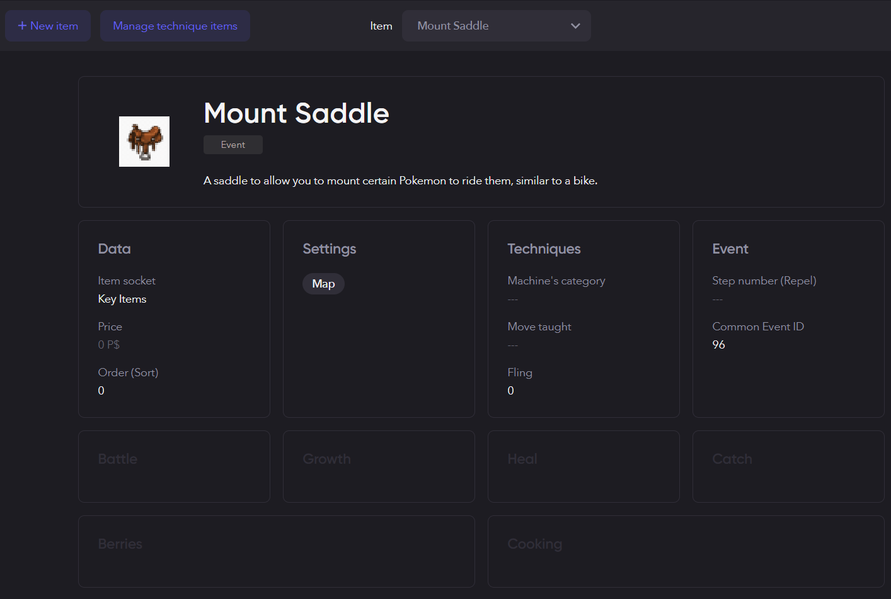

# PSDK-Plugin-Pokemon-Mounts
A PSDK plugin designed to mount Pokemon to ride them around on the map. Currently, it simply replaces the character sprite with a Pokemon sprite. This plugin does not include custom sprites that have the character riding on top of a Pokemon, unfortunately. I am not a sprite artist, so I will leave that up to the community to contribute. 

## How to Use
Download and put the PokemonMounts.psdkplug plugin file into your scripts directory. Then run your game; it will automatically load the plugin. 

## Mount Saddle Key Item
The Mount Saddle is a key item that uses common event code 96. Since plugins cannot overwrite existing files, you will have to edit this item manually via Pokemon Studio. When you load this plugin, you should see a new item in Pokemon Studio, the default being 'TMXX' in English or 'CTXX' in French (other languages may see 'MTXX'). The associated item .json file and .png file are provided by the plugin. If you match the settings in this image, the item should work as intended. 



## Additional Info
The Mount Saddle item uses RMXP common event code 96, which is not included in RMXP by default. You will need to add it in. I added it in by editing the CommonEvents.rxdata.yml file with the following lines under id 96:
```
!ruby/object:RPG::CommonEvent
  id: 96
  list:
  - !ruby/object:RPG::EventCommand
    code: 355
    indent: 0
    parameters:
    - use_mount_saddle
  - !ruby/object:RPG::EventCommand
    code: 0
    indent: 0
    parameters: []
  name: Mount saddle
  switch_id: 1
  trigger: 0
```

You then need to open the cmd.bat file in your project's root directory and run `psdk --util=restore` to load the rxdata.yml files into the .rxdata files. After that you can run your game and the saddle item will work as intended. This may or may not be the proper method to include new CommonEvents into PSDK, but it was my first time creating anything for PSDK and it works. 

NOTE: You can instead just skip the key item entirely. You will see the option to mount or dismount your Pokemon from your party menu. 
